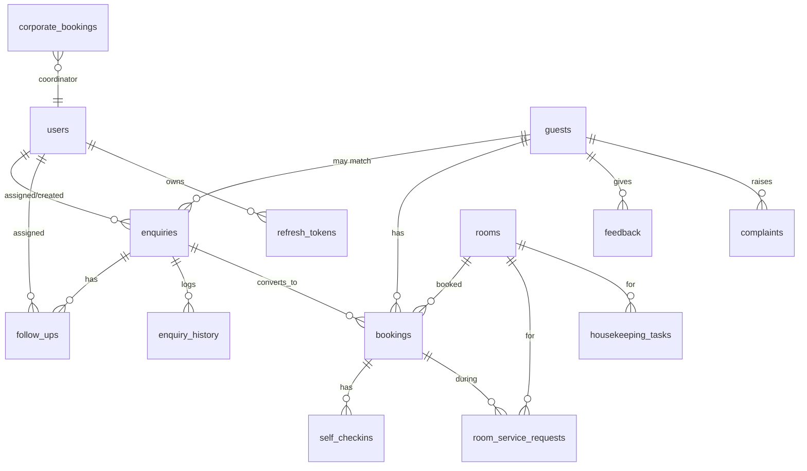

# Database Design (PostgreSQL, 3NF)

UUID primary keys (`gen_random_uuid()`), enum types for controlled vocabularies, FK constraints with sensible ON DELETE rules, indexes on hot filter/search columns, `updated_at` auto-trigger.

## ER Diagram

## Tables (24 enums + 18 tables)
`users, guests, rooms, enquiries, follow_ups, enquiry_history, bookings, self_checkins, room_service_requests, housekeeping_tasks, feedback, complaints, corporate_bookings, group_bookings, shift_handovers, refresh_tokens` plus migration tracking.

## Integrity highlights
- `enquiries.chk_enq_dates` — checkout ≥ checkin.
- `bookings.chk_book_dates` — checkout > checkin.
- `bookings.no_double_booking` — GiST EXCLUDE on `(room_id, daterange)` prevents overlapping reserved/checked-in bookings (true double-booking guard).
- Unique: `users.email`, `guests.mobile`, `rooms.room_number`, `enquiries.ref_code`, `bookings.booking_code`.
- Indexes on status/source/assigned/date columns for fast dashboards & filters.

Full DDL: `backend/db/migrations/001_init.sql`, `002_booking_conflict.sql`.
